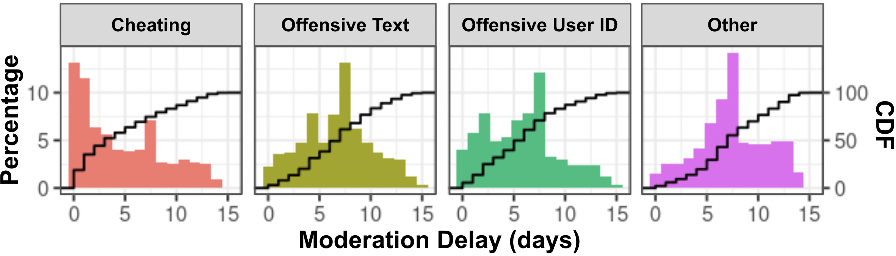

# Deshawn Sambrano's Portfolio

Hi, I am Deshawn Sambrano. I am a Data Scientist/Applied Scientist with a passion for solving problems with data.
I received my PhD from Harvard where I studied Economics, Psychology, and Neuroscience. 
My dissertation focused on consumer choices and designing A/B tests to modify their decisions. 
Here are a few different project that demonstrate my versatility as a Data Scientist, Applied Scientist, and Machine Learning Engineer.

<!-- ${toc} -->

<!-- __TOC__ -->

## Table of Contents

- [Activiation/Call of Duty: Prosocial Behavior Modification][cod] 
- [Behavior Modification][behvaior-mod]
- [Forecasting Consumer Choices][prediction]
- [Biostatistics][health]
- [Bayesian Statistics][bayes]
- [Interactive Demos][demos]

## Activiation/Call of Duty: Prosocial Behavior Modification

⭐ Executive Summary📈: Collaborating with Activision on their renowned game Call of Duty, this project targets the reduction of toxic behavior and the promotion of prosocial interactions among players. Leveraging a combination of traditional analytical methods and cutting-edge machine learning models, we have developed and fine-tuned strategies to enhance the gaming environment. The core of this initiative involves designing and implementing A/B tests, set to roll out globally in the upcoming weeks. These tests are meticulously crafted to assess the effectiveness of various interventions in real-time, aiming to foster a more positive and engaging community within the game. This initiative not only improves the player experience but also sets a precedent for using advanced data-driven techniques to cultivate healthier online communities in the gaming industry.

  

## Behavior Modification: Influencing Consumer Choice
<!--  -->

⭐**Executive Summary**📈: Changing consumer behavior is challenging and costly. 
Here, I show how precisely controlling what is show to the consumer can yield larger changes in consumer behavior with lower costs!
Small but precisely curated emotional inductions can be more impactful to consumer decisions than large scale manipulations.

A behavior modification A/B test designed to evaluated consumer decisions based on their emotional state.

<!--  -->

  

<!--  This should be that manipulation graph from ambig images and just change titles etc and highlight  -->

<!-- ## [Forecasting Risky Decision Making](bayes/bayes.md) -->
## Forecasting Consumer Decisions

⭐ Executive Summary📈: Understanding and predicting consumer choices is pivotal for strategic business decision-making. This project presents a comprehensive model that accurately predicts consumer behavior by analyzing various market trends and psychological factors. By integrating advanced analytics with consumer psychology, this model offers a powerful tool for businesses to forecast consumer preferences, optimize product offerings, and enhance marketing strategies, ultimately leading to more informed decisions and increased profitability. This model stands as a breakthrough in the realm of consumer choice modeling, providing a robust framework for anticipating market dynamics and tailoring business approaches to meet evolving consumer needs.

For this project, I created a custom machine learning model to forecast risky decision making for lotteries.
This analyses for these results were presented in front a large mixed audience and published [here]().
The first plot shows that custom ML model used to forecast consumer decisions.
Specifically, we highlight how we precisely modeled the specific features use to make financial decisions on a per user basis!

<!--  This should be the graph of sigmoids (Ideally one where there are say 5 different sigmoids from the peeps) -->
<!-- For now including the psychometrics, but in reality I should probably grab anything that I have made and select later -->

### Pupil Dilation Predicting Consumer Decisions

⭐Executive Summary📈: Collecting eyetracking data and other physiological measures from consumers near the time of viewing ads can yield strong forecasts for future consumer choices. 

Below is another plot where we highlighted the relationship between the bodily characteristics and consumer choices.
Specifically, we evaluated eyetracking measures (as well as skin sweat, blood pressure, hormone levels and heart rate; not shown)

  

<!--  Should be able to graph one of the ones looking at pupil dilation and just show it here -->

<!-- I can add my pupil one here but in the mean time, adding one from Hao's paper: https://pubmed.ncbi.nlm.nih.gov/37382476/ -->
<!-- Also I want to redo the cortisol measurements one to highlight the profile instead of the delta -->

<!-- Small but precisely curated emotional inductions can be more impactful to consumer decisions than large scale manipulations. Changing consumer behavior is challenging and costly. Here I show how precisely controlling what is show to the consumer can yeild larger changes in consumer behavior with lower costs! -->

## [Bayesian Statistics](bayes/bayes.md)

This [project](bayes/bayes.md) demonstrates my ability to use and easily explain Bayesian Statistics.
Specifically, these plots show how the posterior (the final prediction of the model) changes as you adjust the prior (the background knowledge of the model).

As show with the image on the left, if you don't give your model the proper prior (background knowledge of what is likely to happen) it can be overconfident which can lead to inaccurate predictions and lost of revenue.
In contrast, the plot on the right has a good prior making it more robust to random fluctuations and produces much more stable results yielding more accurate forecasts.

  
  

## Interactive Data Analysis Demonstrations

Below are a couple on live data visualization and analysis demonstrations.
You are given some simulated data and as you adjust the different parameters of the dataset you can see how it changes that data visually as well as from a statistical standpoint.
These demonstrations were used to provide some statistical intuitions for Intro Statistics Student's for a Course I taught at Harvard University.

- [T-TEST](https://dsambrano.shinyapps.io/T-Test/)
- [ANOVA](https://dsambrano.shinyapps.io/ANOVA/)

[behvaior-mod]: #behavior-modification-
[prediction]: #forecating-consumer-decisions
[health]: #pupil-dilation-predicting-consumer-choice
[bayes]: #bayesian-statistics
[demos]: #interactive-data-analysis-demonstrations
[cod]: #activiationcall-of-duty-prosocial-behavior-modification
