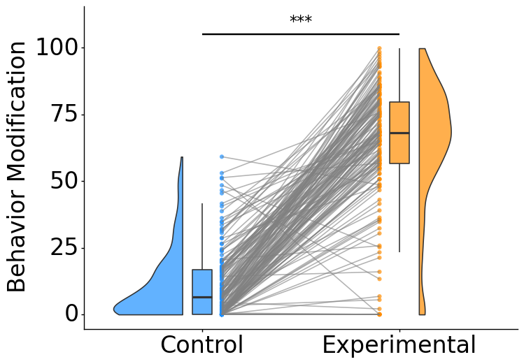
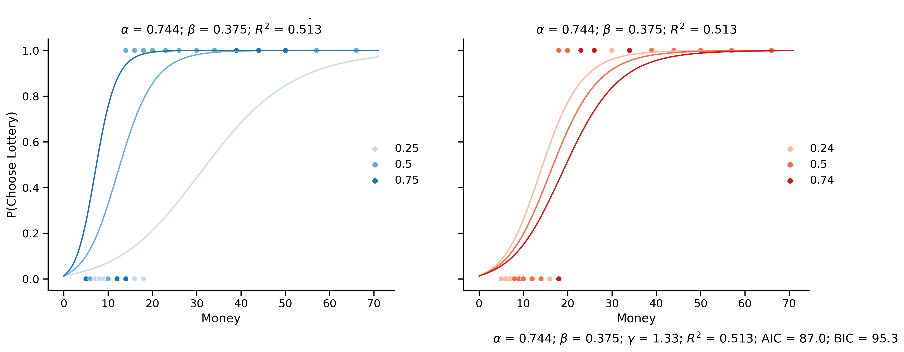
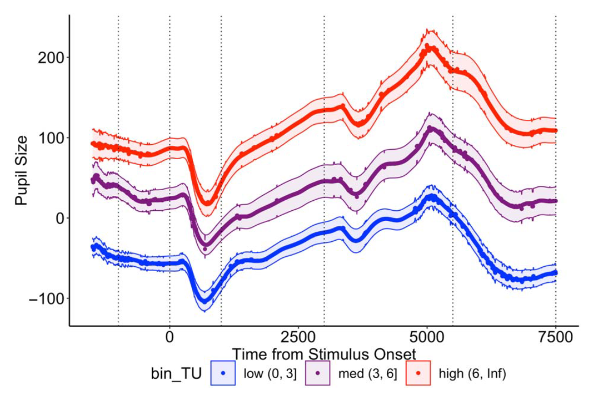

# Deshawn Sambrano's Portfolio

Hi, I am Deshawn Sambrano. I am a Data Scientist/Applied Scientist with a passion for solving problems with data.
I received my PhD from Harvard where I studied Economics, Psychology, and Neuroscience. 
My dissertation focused on consumer choices and designing A/B tests to modify their decisions. 
Here are a few different project that demonstrate my versatility as a Data Scientist, Applied Scientist, and Machine Learning Engineer.

<!-- ${toc} -->

<!-- __TOC__ -->

Dev Plan:

- Here is how I would change this: The titles (sexier) specifically overarching saying these are how I have specifically impacted several different fields to with my research expertise.
Each title becomes like Consumer Modifications, Forecasting consumer Decision Making etc.
- Fix side by side images on Bayes see official [page](https://github.com/dsambrano/portfolio?tab=readme-ov-file#deshawn-sambranos-portfolio)

## [Emotion Influences Decision Making](bayes/bayes.md)
<!--  -->

A behavior modification A/B test designed to evaluated consumer decisions based on their emotional state.

<!--  -->

<!--  This should be that manipulation graph from ambig images and just change titles etc and highlight  -->

⭐**Executive Summary**📈: Changing consumer behavior is challenging and costly. 
Here, I show how precisely controlling what is show to the consumer can yeild larger changes in consumer behavior with lower costs!
Small but precisely curated emotional inductions can be more impactful to consumer decisions than large scale manipulations.

<!-- ## [Forecasting Risky Decision Making](bayes/bayes.md) -->
## Forecasting Risky Decision Making

For this project, I created a custom machine learning model to forecast risky decision making for lotteries.
This analyses for these results were presented in front a large mixed audience and published [here]().
The first plot shows that custom ML model used to forecast consumer decisions.
Specifically, we highlight how we precisely modeled the specific features use to make financial decisions on a per user basis!

<!--  This should be the graph of sigmoids (Ideally one where there are say 5 different sigmoids from the peeps) -->
<!-- For now including the psychometrics, but in reality I should probably grab anything that I have made and select later -->

### Pupil Dilation Predicting Consumer Decisions

Below is another plot where we highlight the relationship between the bodily characteristics and consumer choices.
Specifically, we evaluated pupil size (as well as skin sweat, blood pressure, hormone levels and heart rate; not shown)

<!--  Should be able to graph one of the ones looking at pupil dilation and just show it here -->

<!-- I can add my pupil one here but in the mean time, adding one from Hao's paper: https://pubmed.ncbi.nlm.nih.gov/37382476/ -->
<!-- Also I want to redo the cortisol measurements one to highlight the profile instead of the delta -->

⭐**Executive Summary**📈: Collecting small, noninvasive physiological measures for consumers near the time of viewing ads can yeild strong forecasts for future consumers choices.

<!-- Small but precisely curated emotional inductions can be more impactful to consumer decisions than large scale manipulations. Changing consumer behavior is challenging and costly. Here I show how precisely controlling what is show to the consumer can yeild larger changes in consumer behavior with lower costs! -->

## [Bayesian Statistics](bayes/bayes.md)

This [project](bayes/bayes.md) demonstrates my ability to use and easily explain Bayesian Statistics.
Specifically, these plots show how the posterior (the final prediction of the model) changes as you adjust the prior (the background knowledge of the model).

As show with the image on the left, if you don't give your model the proper prior (background knowledge of what is likely to happen) it can be overconfident which can lead to inaccurate predictions and lost of revenue.
In contrast, the plot on the right has a good prior making it more robust to random fluctuations and produces much more stable results yielding more accurate forecasts.

## Interactive Data and Analysis Demonstrations

Below are a couple on live data visualization and analysis demonstrations. You are given some simulated data and as you adjust the different parameters of the dataset you can see how it changes that data visually as well as from a statistical standpoint. These demonstrations were used to provide some statiscal intuitions for Intro Statiscs Students for a Course I taught at Harvard University.

- [T-TEST](https://dsambrano.shinyapps.io/T-Test/)
- [ANOVA](https://dsambrano.shinyapps.io/ANOVA/)
