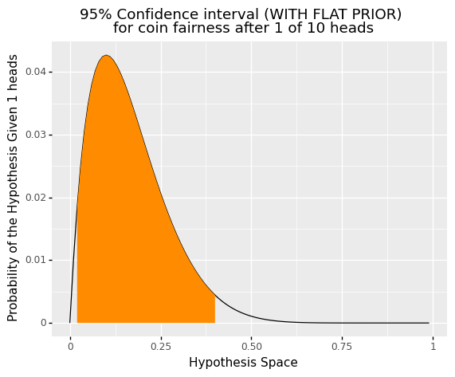
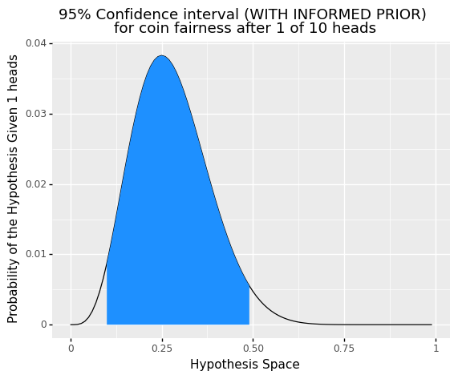

# Deshawn Sambrano's Portfolio

Here are a few different project that demonstrate my versatility as a Data Scientist, Applied Scientist, and Machine Learning Engineer.

<!-- ${toc} -->

<!-- __TOC__ -->

Dev Plan:

- Here is how I would change this: The titles (sexier) specifically overarching saying these are how I have specifically impacted several different feilds to with my research expertise.
Each title becomes like Consumer Modifications, Forcasting consumer Decision Making etc.

## [Bayesian Statistics](bayes/bayes.md)

## [Emotion Influences Decision Making](bayes/bayes.md)
<!--  -->

## [Forecasting Risky Decision Making](bayes/bayes.md)

For this project, I created a custom machine learning model to forecast risky decision making for lotteries. 
<!--  -->

## [Interactive Data and Analysis Demonstrations](bayes/bayes.md)
<!--  -->

Below are a couple on live data visualization and analysis demonstrations. You are given some simulated data and as you adjust the different parameters of the dataset you can see how it changes that data visually as well as from a statistical standpoint. These demonstrations were used to teach 101 students statistics at Harvard University.

- [T-TEST](https://dsambrano.shinyapps.io/T-Test/)
- [ANOVA](https://dsambrano.shinyapps.io/ANOVA/)
